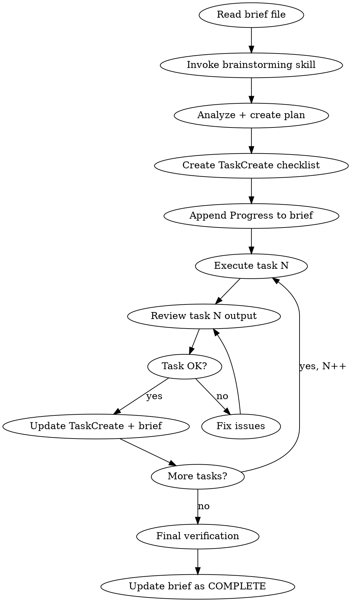

# Tony Workflow

## Overview

Read a markdown brief file, brainstorm via `superpowers:brainstorming`, break into tasks, track progress with TaskCreate (terminal) and appended Progress section in the brief file, then execute each task sequentially with review between tasks.

## Flow



## Instructions

### 1. Read the brief

The user provides a path as argument: `/tony-wf path/to/brief.md`

Read the file. If no path given, ask for it.

### 2. Brainstorm (REQUIRED)

**Before planning, invoke the `superpowers:brainstorming` skill.** This explores user intent, requirements, and design before jumping into implementation. Do NOT skip this step.

### 3. Analyze and plan

After brainstorming:
- Understand all requirements from the brief
- Break into discrete, ordered tasks
- Identify dependencies between tasks

### 4. Create dual tracking

**TaskCreate (terminal):** Create a task for each item using TaskCreate.

**Progress in brief (file):** Append a `## Progress` section directly into the brief file (do NOT create a separate PROGRESS.md). Format:

```markdown
---

## Progress

Started: [date]

| # | Task | Status | Notes |
|---|------|--------|-------|
| 1 | Task description | ⬜ | |
| 2 | Task description | ⬜ | |

### Log

#### ⬜ Task 1: [name]
- Status: ⬜ pending
- Started: -
- Completed: -
```

### 5. Execute sequentially

For each task:
1. Update status to 🔄 `in-progress` in both TodoWrite and PROGRESS.md
2. Execute the task
3. **Review the output** - check quality, correctness, no regressions
4. If review fails → fix → re-review
5. If review passes → update status to ✅ `completed` in both TodoWrite and PROGRESS.md, add notes
6. Move to next task

### Status icons
- ⬜ pending
- 🔄 in-progress
- ✅ completed

### 6. Final verification

After all tasks complete:
- Run relevant verification (tests, build, lint) if applicable
- Update PROGRESS.md status to COMPLETE with summary
- Report final status to user

## Red Flags

| Thought | Reality |
|---------|---------|
| "Skip review, it's simple" | Every task gets reviewed. No exceptions. |
| "Update PROGRESS.md later" | Update both trackers immediately after each task. |
| "Skip to next task" | Current task must pass review first. |
| "Brief is unclear, just guess" | Ask the user for clarification. |
