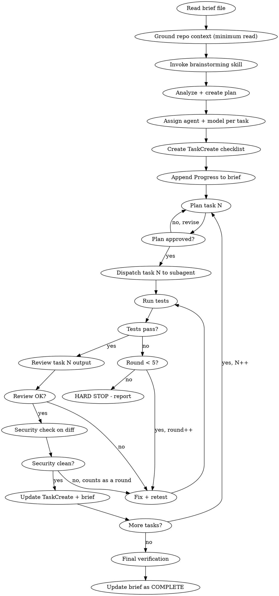

# Tony Workflow

## Overview

Read a markdown brief file → ground yourself in the repo (minimum read, no eager skill loading) → brainstorm via `superpowers:brainstorming` → break into tasks → dual tracking (TaskCreate + `## Progress` in the brief) → **plan each task before dispatching it** → execute through the right specialist subagent → test-fix loop capped at 5 rounds → review → **security check on the diff** → next task.

## Flow


```dot
digraph tony_wf {
    rankdir=TB;
    "Read brief file" -> "Ground repo context (minimum read)";
    "Ground repo context (minimum read)" -> "Invoke brainstorming skill";
    "Invoke brainstorming skill" -> "Analyze + create plan";
    "Analyze + create plan" -> "Assign agent + model per task";
    "Assign agent + model per task" -> "Create TaskCreate checklist";
    "Create TaskCreate checklist" -> "Append Progress to brief";
    "Append Progress to brief" -> "Plan task N";
    "Plan task N" -> "Plan approved?" [shape=diamond];
    "Plan approved?" -> "Plan task N" [label="no, revise"];
    "Plan approved?" -> "Dispatch task N to subagent" [label="yes"];
    "Dispatch task N to subagent" -> "Run tests";
    "Run tests" -> "Tests pass?" [shape=diamond];
    "Tests pass?" -> "Review task N output" [label="yes"];
    "Tests pass?" -> "Round < 5?" [label="no"];
    "Round < 5?" -> "Fix + retest" [label="yes, round++"];
    "Round < 5?" -> "HARD STOP - report" [label="no"];
    "Fix + retest" -> "Run tests";
    "Review task N output" -> "Review OK?" [shape=diamond];
    "Review OK?" -> "Security check on diff" [label="yes"];
    "Review OK?" -> "Fix + retest" [label="no"];
    "Security check on diff" -> "Security clean?" [shape=diamond];
    "Security clean?" -> "Update TaskCreate + brief" [label="yes"];
    "Security clean?" -> "Fix + retest" [label="no, counts as a round"];
    "Update TaskCreate + brief" -> "More tasks?" [shape=diamond];
    "More tasks?" -> "Plan task N" [label="yes, N++"];
    "More tasks?" -> "Final verification" [label="no"];
    "Final verification" -> "Update brief as COMPLETE";
}
```

## Instructions

### 1. Read the brief

The user provides a path as argument: `/tony-wf path/to/brief.md`

Read the file. If no path given, ask for it.

### 2. Establish repo context (REQUIRED)

Before brainstorming, ground yourself in the target repo — but read the minimum that grounds you,
not everything that exists. Context spent here is context not available for the work.

**Repo has a `CLAUDE.md`** (every Avada app does) — read, in this order, and stop when grounded:

1. `<repo>/CLAUDE.md` — always.
2. `<repo>/packages/<pkg>/CLAUDE.md` — only for the packages the brief will actually touch.
3. `ls <repo>/.claude/skills/` — the **names only**. Claude Code already injects each skill's
   name and description; that listing is what tells you which skills exist.

**Do NOT read the skill bodies here.** A `SKILL.md` gets read in §6, when a task actually routes
to it. On `seo` the 16 skill bodies are ~51k tokens — reading them up front burns a quarter of a
200k window on 15 skills the brief never touches, and you pay it again on every `/resume`.

**Repo has no `CLAUDE.md`** (`avachat`, `fleet-control`, `worker-sdk`, `team-ops`, and the other
libs) — **stop and ask the user to run `/init`**. `/init` is a Claude Code built-in slash command,
not a skill; you cannot invoke it yourself, and it writes a file into their repo. Do not
hand-write a substitute `CLAUDE.md`, and never overwrite a hand-written one — if it looks stale,
say so and let the user decide.

Repo skills and docs are per-repo. Never import another app's skill as fact.

### 3. Brainstorm (REQUIRED)

Invoke the `superpowers:brainstorming` skill. Explores intent, requirements, and design before implementation. Do NOT skip.

### 4. Analyze and plan

After brainstorming:
- Understand all requirements from the brief
- Break into discrete, ordered tasks
- Identify dependencies between tasks
- **Assign each task an executor** — see the routing table below

#### Task routing: agent + model

| Task shape | Agent | Model | Why |
|---|---|---|---|
| Find where code lives, map a directory, list callers | `cavecrew-investigator` | haiku | Read-only lookup, compressed output |
| Broad multi-directory sweep, unknown naming conventions | `Explore` | sonnet | Needs judgment on where to look |
| Typo, rename, single-function rewrite, 1–2 file mechanical edit | `cavecrew-builder` | haiku | Bounded scope, refuses 3+ files |
| New feature, new files, cross-file refactor | `general-purpose` | sonnet | Needs full toolset + context |
| Architecture decision, tricky algorithm, security-sensitive change | `general-purpose` | opus | Cost of being wrong is high |
| Design an implementation strategy for a hard task | `Plan` | opus | Architect role, no writes |
| Review a diff / file / branch | `cavecrew-reviewer` | sonnet | Severity-tagged, no scope creep |
| Domain-specific (UI/UX, Shopify, billing, credits, Jira) | matching **skill**, executed inline | — | Skill beats generic agent |

Rules:
- **One task = one agent.** Do not hand a subagent two unrelated tasks.
- **Independent tasks can be dispatched in parallel** — one message, multiple Agent calls. Dependent tasks stay sequential.
- Give each subagent: the task statement, the files it may touch, the acceptance test, and "do not touch anything outside this scope".
- Record the chosen agent + model in the Progress table so the routing is auditable.
- If no agent fits and the task is small, do it inline. Do not invent an agent type.

### 5. Create dual tracking

**TaskCreate (terminal):** one task per item.

**Progress in brief (file):** append a `## Progress` section directly into the brief file (do NOT create a separate PROGRESS.md). Format:

```markdown
---

## Progress

Started: [date]

| # | Task | Agent / Model | Status | Rounds | Sec | Notes |
|---|------|---------------|--------|--------|-----|-------|
| 1 | Task description | cavecrew-builder / haiku | ⬜ | 0/5 | — | |
| 2 | Task description | general-purpose / sonnet | ⬜ | 0/5 | — | |

### Log

#### ⬜ Task 1: [name]
- Agent: cavecrew-builder (haiku)
- Status: ⬜ pending
- Plan:
  - Goal: -
  - Files allowed: -
  - Approach: -
  - Test command: `...`
  - Risk: -
  - Rollback: -
- Rounds used: 0/5
- Security check: -
- Started: -
- Completed: -
```

The `Sec` column holds the §8 verdict: `clean` / `fixed` / `accepted` / `—` (not run yet).

**Watching a run from another terminal.** The brief on disk is the shared state, so a workflow
running in one session can be monitored from anywhere else:

```
watch -n 300 python3 ~/.claude/skills/tony-wf/progress.py <brief.md>
```

`progress.py` prints the tally, every task not yet ✅, and a warning for any task at cap−1.
Exit code 2 when something is 🛑. No model, no tokens — do not spend a `/loop` firing on
reading a markdown table. Reach for `/loop` only when you want a *judgment* on the run
(is a task thrashing? is the same fix being retried under different words?), not a status line.

### 6. Plan the task before dispatching it (REQUIRED, per task)

Step 4 planned the *brief*. This plans **one task**, immediately before it runs — the brief-level
plan is too coarse to hand a subagent, and a subagent that has to guess its own boundaries is
what produces a 4-file diff for a 1-file task.

Write a short plan into the task's Log entry in the brief. Six lines, no prose:

```markdown
- Goal: one sentence, what "done" means observably
- Files allowed: explicit list or glob. Anything outside is out of scope
- Approach: the chosen way, one line — plus what you rejected and why (one line)
- Test command: the exact command, with the expected result
- Risk: what breaks if this is wrong — data, other apps, prod path
- Rollback: how to undo (revert commit / feature flag / it's additive, nothing to undo)
```

Rules:
- **No plan → no dispatch.** The plan is what goes into the subagent prompt verbatim; if you
  cannot write it, you do not understand the task well enough to hand it off.
- **Read before planning.** Open the files you intend to change first. A plan written from
  memory or from a grep hit is a guess. Cite `file:line` for anything the plan asserts.
- **Hard task → plan with a real architect.** Route it to the `Plan` agent (opus, no writes)
  and use its output as the plan. Cheap compared to a wrong cross-file refactor.
- **Plan changes mid-task → rewrite it in the brief before continuing.** A silently drifted
  plan makes the round count meaningless.
- **Scope creep found while planning** (task is really three tasks, or it depends on something
  not in the brief) → stop, split it in both trackers, tell the user. Do not absorb it silently.

### 7. Execute sequentially with a capped test-fix loop

For each task:

1. Set status 🔄 `in-progress` in **both** TaskCreate and the brief's Progress section.
2. Write the per-task plan (§6). No plan → do not dispatch.
3. Dispatch to the assigned agent/model (or run inline if the routing table says so), passing the plan.
4. **Run the task's test command.** Every task needs a concrete pass/fail check before it starts — a test, a build, a lint, a script that reproduces the bug. No check defined → define one before executing.
5. Loop while tests fail:
   - `round++`
   - **Hard cap: 5 rounds.** On round 5 failing → **STOP THE WHOLE WORKFLOW.** Do not start the next task, do not spend more tokens fixing.
   - Diagnose via `superpowers:systematic-debugging`, fix, rerun the test command.
6. Tests pass → **review the output** (quality, correctness, no regressions). Review fails → counts as a failed round, back to step 5 under the same 5-round cap.
7. Review passes → **run the security check on the diff** (§8). Not clean → counts as a failed round, back to step 5 under the same cap.
8. Security clean → set ✅ `completed` in both trackers, write the round count, the security-check verdict, and notes.
9. Next task.

#### On hitting the 5-round cap

Stop immediately and report:
- Which task, which agent/model
- The test command and the **exact last failure output**, quoted
- What each of the 5 rounds tried and why it failed
- Mark the task 🛑 in both trackers, mark the workflow **BLOCKED** in the brief

Then hand back to the user. Do not retry, do not swap models and start a fresh 5, do not "just try one more thing".

### 8. Security check after every task (REQUIRED)

Run this on the task's **diff**, not on the whole repo, after the review passes and before the
task is marked ✅. Green tests say the feature works; they say nothing about what it leaked.

Get the diff first — `git diff` for uncommitted work, `git diff <base>...HEAD` for a branch —
then check every hunk against this list. Load the repo's own `security` skill if it has one
(`<repo>/.claude/skills/security/`) and apply its threat model on top; the list below is the
floor, not the ceiling.

| # | Check | Fail looks like |
|---|---|---|
| 1 | **No secret in the diff** | API key, token, password, webhook secret, service-account JSON written as a literal. Also: a secret moved into a comment or a test fixture |
| 2 | **No secret on a command line or in a log** | `sshpass -p`, `redis-cli -a`, `curl -H "Authorization: ..."`, or a `console.log`/logger call that prints a token, a full request header, or a whole config object |
| 3 | **Shop scoping is intact** | A Firestore query, a repository call, or an API handler that reads or writes without filtering by the caller's own shop id — cross-shop IDOR is the top risk in a Shopify app with no PII scope |
| 4 | **Request input is untrusted** | Shop domain, plan, quota, price, or role taken from the request body/query instead of from the session or from Firestore |
| 5 | **Forbidden files untouched** | `.env*`, lockfiles, `.gitlab-ci.yml`, `firebase.json`, `.firebaserc`, IAM or Firestore rules appearing in the diff when the task never asked for them |
| 6 | **No new external call or dependency smuggled in** | A new package, a new outbound host, or a new webhook target that the plan (§6) never mentioned. A new dep also means `yarn.lock` must be committed — CI uses immutable install |
| 7 | **Blast radius stated** | The diff touches a prod path, a migration, or a delete, and nobody wrote down what happens if it is wrong |

Verdict, written into the task's Log entry:
- **clean** — checked, nothing found. Say what you diffed (`git diff --stat` line count) so it's auditable.
- **fixed** — found something, fixed it, this counts as a failed round.
- **accepted** — found something and *deliberately* keeping it. Requires the user's explicit
  say-so, recorded in the brief. Never accept on your own.

Rules:
- **Never** "fix" a secret by deleting the line and moving on — a committed secret is burned.
  Report it, say it needs rotation, and let the user rotate it. `n9axd7` is the precedent:
  a hardcoded Crisp credential, revoked out-of-band before the fix landed.
- A security finding **outside** the task's scope is still reported — as a finding, not as an
  edit. Do not widen the diff to fix it.
- Skipping the check because "this task was only docs/CSS/tests" is not allowed. Run it; a
  docs-only diff clears in seconds, and docs are exactly where pasted credentials hide.

### Status icons
- ⬜ pending
- 🔄 in-progress
- ✅ completed
- 🛑 blocked (hit the 5-round cap)

### 9. Final verification

After all tasks complete:
- Run the repo's real verification (tests, build, lint) and **paste the output**. No claim of "passing" without seeing it.
- Run the §8 security check once more over the **whole** branch diff, not just the last task — a
  combination of two individually clean diffs can still be wrong (a secret added in task 2 and
  a new log line added in task 5 that prints it).
- Update the brief's Progress section to COMPLETE with a summary, total rounds used, and the
  final security verdict
- Report final status to user

## Red Flags

| Thought | Reality |
|---------|---------|
| "Skip repo context, I know this repo" | Repo context is per-repo. Read it. |
| "Read all 16 skills up front, be safe" | ~51k tokens, 15 of them unused. Read a SKILL.md when a task routes to it. |
| "No CLAUDE.md, I'll write one" | `/init` is the user's call and their file. Ask; do not hand-write a substitute. |
| "Skip review, it's simple" | Every task gets reviewed. No exceptions. |
| "Update the brief later" | Update both trackers immediately after each task. |
| "Skip to next task" | Current task must pass tests AND review first. |
| "Brief is unclear, just guess" | Ask the user for clarification. |
| "Round 6 will fix it" | 5 is a hard stop. Report and hand back. |
| "Different model, fresh 5 rounds" | The cap is per task, not per model. Still stopped. |
| "Opus for everything, it's smarter" | Wrong model wastes budget. Follow the routing table. |
| "This task has no test" | Then define one before executing. |
| "Small task, skip the plan" | The plan is six lines. The unplanned subagent's 4-file diff is not. |
| "I'll plan it in my head" | The plan goes in the brief. Unwritten plans drift and nobody can audit them. |
| "Tests green, ship it" | Green tests prove it works, not that it's safe. §8 runs before ✅. |
| "Only CSS/docs changed, no security check" | Run it anyway. Docs are where pasted credentials hide. |
| "Found a secret, I'll just delete the line" | A committed secret is burned. Report it, it needs rotation, not deletion. |
| "Security finding, let me fix that too" | Outside scope → report it, don't widen the diff. |
