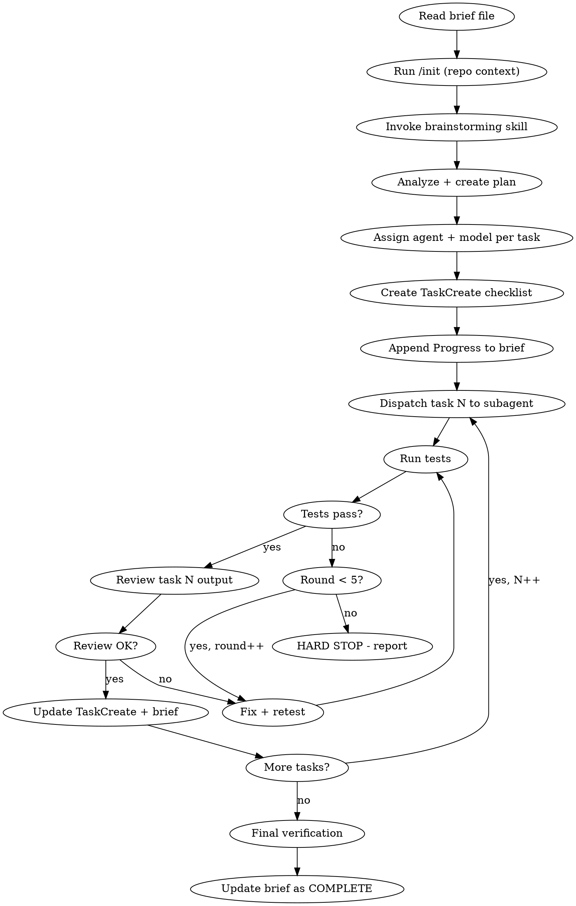

# Tony Workflow

## Overview

Read a markdown brief file → `/init` for repo context → brainstorm via `superpowers:brainstorming` → break into tasks → dual tracking (TaskCreate + `## Progress` in the brief) → execute each task through the right specialist subagent → test-fix loop capped at 5 rounds → review → next task.

## Flow


```dot
digraph tony_wf {
    rankdir=TB;
    "Read brief file" -> "Run /init (repo context)";
    "Run /init (repo context)" -> "Invoke brainstorming skill";
    "Invoke brainstorming skill" -> "Analyze + create plan";
    "Analyze + create plan" -> "Assign agent + model per task";
    "Assign agent + model per task" -> "Create TaskCreate checklist";
    "Create TaskCreate checklist" -> "Append Progress to brief";
    "Append Progress to brief" -> "Dispatch task N to subagent";
    "Dispatch task N to subagent" -> "Run tests";
    "Run tests" -> "Tests pass?" [shape=diamond];
    "Tests pass?" -> "Review task N output" [label="yes"];
    "Tests pass?" -> "Round < 5?" [label="no"];
    "Round < 5?" -> "Fix + retest" [label="yes, round++"];
    "Round < 5?" -> "HARD STOP - report" [label="no"];
    "Fix + retest" -> "Run tests";
    "Review task N output" -> "Review OK?" [shape=diamond];
    "Review OK?" -> "Update TaskCreate + brief" [label="yes"];
    "Review OK?" -> "Fix + retest" [label="no"];
    "Update TaskCreate + brief" -> "More tasks?" [shape=diamond];
    "More tasks?" -> "Dispatch task N to subagent" [label="yes, N++"];
    "More tasks?" -> "Final verification" [label="no"];
    "Final verification" -> "Update brief as COMPLETE";
}
```

## Instructions

### 1. Read the brief

The user provides a path as argument: `/tony-wf path/to/brief.md`

Read the file. If no path given, ask for it.

### 2. Establish repo context with /init (REQUIRED)

Before brainstorming, ground yourself in the target repo:

- If the repo has **no** `CLAUDE.md` → invoke the `init` skill to generate one.
- If it **has** one → read it plus any `<repo>/.claude/skills/` entries instead of regenerating. Do not overwrite a hand-written `CLAUDE.md`; if it looks stale, say so and ask before running `init`.

Repo skills and docs are per-repo. Never import another app's skill as fact.

### 3. Brainstorm (REQUIRED)

Invoke the `superpowers:brainstorming` skill. Explores intent, requirements, and design before implementation. Do NOT skip.

### 4. Analyze and plan

After brainstorming:
- Understand all requirements from the brief
- Break into discrete, ordered tasks
- Identify dependencies between tasks
- **Assign each task an executor** — see the routing table below

#### Task routing: agent + model

| Task shape | Agent | Model | Why |
|---|---|---|---|
| Find where code lives, map a directory, list callers | `cavecrew-investigator` | haiku | Read-only lookup, compressed output |
| Broad multi-directory sweep, unknown naming conventions | `Explore` | sonnet | Needs judgment on where to look |
| Typo, rename, single-function rewrite, 1–2 file mechanical edit | `cavecrew-builder` | haiku | Bounded scope, refuses 3+ files |
| New feature, new files, cross-file refactor | `general-purpose` | sonnet | Needs full toolset + context |
| Architecture decision, tricky algorithm, security-sensitive change | `general-purpose` | opus | Cost of being wrong is high |
| Design an implementation strategy for a hard task | `Plan` | opus | Architect role, no writes |
| Review a diff / file / branch | `cavecrew-reviewer` | sonnet | Severity-tagged, no scope creep |
| Domain-specific (UI/UX, Shopify, billing, credits, Jira) | matching **skill**, executed inline | — | Skill beats generic agent |

Rules:
- **One task = one agent.** Do not hand a subagent two unrelated tasks.
- **Independent tasks can be dispatched in parallel** — one message, multiple Agent calls. Dependent tasks stay sequential.
- Give each subagent: the task statement, the files it may touch, the acceptance test, and "do not touch anything outside this scope".
- Record the chosen agent + model in the Progress table so the routing is auditable.
- If no agent fits and the task is small, do it inline. Do not invent an agent type.

### 5. Create dual tracking

**TaskCreate (terminal):** one task per item.

**Progress in brief (file):** append a `## Progress` section directly into the brief file (do NOT create a separate PROGRESS.md). Format:

```markdown
---

## Progress

Started: [date]

| # | Task | Agent / Model | Status | Rounds | Notes |
|---|------|---------------|--------|--------|-------|
| 1 | Task description | cavecrew-builder / haiku | ⬜ | 0/5 | |
| 2 | Task description | general-purpose / sonnet | ⬜ | 0/5 | |

### Log

#### ⬜ Task 1: [name]
- Agent: cavecrew-builder (haiku)
- Status: ⬜ pending
- Test command: `...`
- Rounds used: 0/5
- Started: -
- Completed: -
```

### 6. Execute sequentially with a capped test-fix loop

For each task:

1. Set status 🔄 `in-progress` in **both** TaskCreate and the brief's Progress section.
2. Dispatch to the assigned agent/model (or run inline if the routing table says so).
3. **Run the task's test command.** Every task needs a concrete pass/fail check before it starts — a test, a build, a lint, a script that reproduces the bug. No check defined → define one before executing.
4. Loop while tests fail:
   - `round++`
   - **Hard cap: 5 rounds.** On round 5 failing → **STOP THE WHOLE WORKFLOW.** Do not start the next task, do not spend more tokens fixing.
   - Diagnose via `superpowers:systematic-debugging`, fix, rerun the test command.
5. Tests pass → **review the output** (quality, correctness, no regressions). Review fails → counts as a failed round, back to step 4 under the same 5-round cap.
6. Review passes → set ✅ `completed` in both trackers, write the round count and notes.
7. Next task.

#### On hitting the 5-round cap

Stop immediately and report:
- Which task, which agent/model
- The test command and the **exact last failure output**, quoted
- What each of the 5 rounds tried and why it failed
- Mark the task 🛑 in both trackers, mark the workflow **BLOCKED** in the brief

Then hand back to the user. Do not retry, do not swap models and start a fresh 5, do not "just try one more thing".

### Status icons
- ⬜ pending
- 🔄 in-progress
- ✅ completed
- 🛑 blocked (hit the 5-round cap)

### 7. Final verification

After all tasks complete:
- Run the repo's real verification (tests, build, lint) and **paste the output**. No claim of "passing" without seeing it.
- Update the brief's Progress section to COMPLETE with a summary + total rounds used
- Report final status to user

## Red Flags

| Thought | Reality |
|---------|---------|
| "Skip /init, I know this repo" | Repo context is per-repo. Read it. |
| "Skip review, it's simple" | Every task gets reviewed. No exceptions. |
| "Update the brief later" | Update both trackers immediately after each task. |
| "Skip to next task" | Current task must pass tests AND review first. |
| "Brief is unclear, just guess" | Ask the user for clarification. |
| "Round 6 will fix it" | 5 is a hard stop. Report and hand back. |
| "Different model, fresh 5 rounds" | The cap is per task, not per model. Still stopped. |
| "Opus for everything, it's smarter" | Wrong model wastes budget. Follow the routing table. |
| "This task has no test" | Then define one before executing. |
